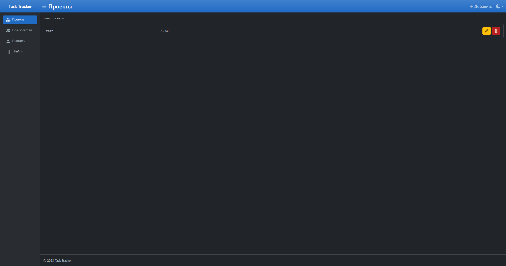
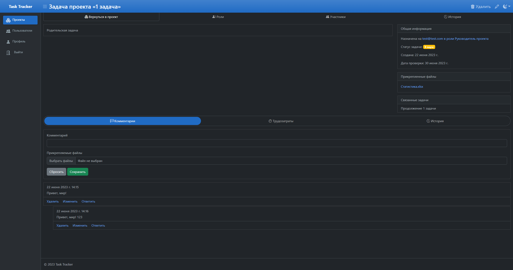

# Task Tracker (Lite)

## Описание проекта

Task-tracker является веб-приложением для управления проектами. Инструмент позволяет сортировать, группировать и планировать задачи. 

В проекте можно:
- Управлять спринтами
- Управлять командой (ролями и участниками)
- Управлять задачами
- Просматривать историю изменения проектов

## Используемый стек

Веб-приложение разворачивается в Docker для удобства локальной разработки в ОС Windows с WSL2. Были настроены следующие контейнеры:
- Nginx (образ nginx:latest)
- Python (образ python:3.11-buster)
- Postgres (образ postgres:latest)

Для функционирования веб-приложения требуются следующие пакеты (указаны в файле `requirements.txt`, устанавливаются при запуске сборки контейнеров):
- Django 4.2.2
- gunicorn 20.1.0
- gevent 22.10.2
- psycopg2 2.9.6
- django-registration 3.3
- requests 2.31.0
- django-admin-tools 0.9.2

## Интерфейс веб-приложения

Интерфейс сверстан с использованием следующих библиотек:
- bootstrap 5.3.0-alpha3
- bootstrap-icons 1.10.0
- ckeditor5 36.0.1
- htmx 1.9.0
- popper
- sortable 1.15.0

Скриншоты интерфейса находятся в папке screenshoots. Превью всех изображений ниже.

|              Светлая тема               |               Темная тема               |
|:---------------------------------------:|:---------------------------------------:|
|   |   |
|   |   |
|   |   |
|   |   |
|  |  |
|  |  |
|  |  |
|  |  |
|  |  |
|  |  |